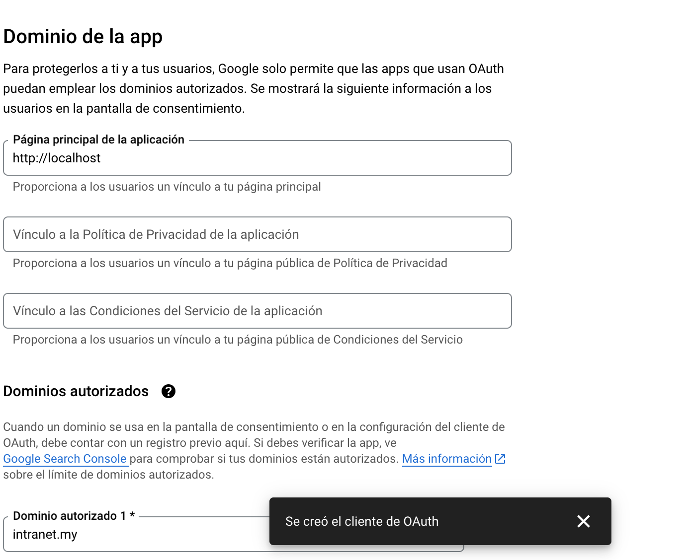
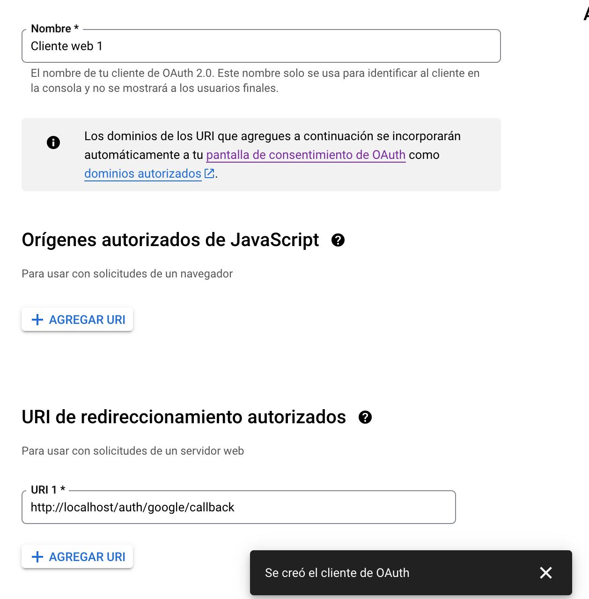

<style>
    img { margin: 20px 0; border-radius: 8px; }

    .alert { color: #BD1550; }
    .warning { color: #E97F02; }
    .success { color: #8A9B0F; }

    .center { text-align: center; }
    .right { text-align: right; }

    .img-small { max-width: 200px; margin: auto; }
    .img-medium { max-width: 400px; margin: auto; }
    .img-large { max-width: 800px; margin: auto; }

    .leyenda {
        font-size: small;
        margin: 10px 0;
    }
</style>

# Webs híbrides

> Duració estimada: 8 sessions

## Característiques de les webs híbrides

Les aplicacions web híbrides, també conegudes com a "mashups", són una combinació de dades i/o funcionalitats provinents de diverses fonts per a crear un nou tipus d'aplicació o servei.
Les seues característiques principals són:

* Integració de Dades de Diversos Orígens: Les aplicacions web híbrides aprofiten dades i funcionalitats de múltiples fonts, com ara serveis web, APIs, i altres recursos en línia. Això permet combinar i reutilitzar recursos existents de manera creativa per a desenvolupar aplicacions més complexes i funcionals.
* Ús de Serveis Web i APIs: Moltes d'aquestes aplicacions utilitzen dades accessibles a través de serveis web, com els que ofereixen empreses com Google, Yahoo!, Flickr, Microsoft, i Amazon. Aquestes dades es troben sovint en formats com JSON o XML i es poden accedir i manipular mitjançant APIs específiques.
* Sindicació Web (RSS/Atom): Algunes aplicacions web híbrides fan ús de protocols de sindicació web, com RSS o Atom, per accedir a continguts actualitzats de manera regular. Aquests protocols simplifiquen el procés de compartir i distribuir continguts web.
* Dades Internes: A més de les fonts externes, les aplicacions web híbrides poden incloure dades internes generades i gestionades per l'entitat propietària de l'aplicació, com podrien ser les dades corporatives o de negoci.
* Web Scraping: Encara que és menys comú, algunes aplicacions utilitzen tècniques d'enginyeria inversa, com el web scraping, per extreure dades des de llocs web. Això pot ser útil per obtenir informació com els preus dels productes en les botigues en línia.

Aquesta actualització reflecteix l'evolució constant en el camp del desenvolupament web i la integració de tecnologies, destacant la importància de les fonts diverses de dades i la capacitat de combinar-les de forma innovadora en el disseny d'aplicacions web híbrides​​.

## Utilització de repositoris d'informació

Per a poder reutilitzar codi i informació cal que tingem en conte les següents consideracions:

* **Integració de Serveis Web de Tercers**: En el desenvolupament d'aplicacions web híbrides, és comú utilitzar serveis proporcionats per tercers. Aquests serveis poden oferir funcionalitats específiques que enriquiran l'aplicació sense necessitat de desenvolupar-les des de zero. Un exemple podria ser l'ús de l'API de Google Maps per mostrar la ubicació geogràfica de les franquícies d'una empresa en un mapa.
* **Desenvolupament d'Aplicacions Pràctiques**: En aquest context, es posa l'accent en el desenvolupament d'aplicacions que faciliten processos específics, com podria ser la gestió d'enviaments en una botiga en línia. Aquest tipus d'aplicació pot millorar significativament l'experiència dels usuaris i l'eficiència de les operacions de l'empresa.
* **Reconeixement de Necessitats i Oportunitats**: És important identificar funcionalitats que poden ser útils per als usuaris, fins i tot quan aquests no les han sol·licitat explícitament. Aquesta anticipació de necessitats pot ser un factor clau en el desenvolupament d'aplicacions web híbrides exitoses.
* **Condicions i Límits en l'Ús de Serveis de Tercers**: Quan s'utilitzen serveis de tercers, cal tenir en compte les condicions i límits que aquests imposen. Això inclou restriccions d'ús, límits de sol·licituds, entre d'altres aspectes legals i tècnics.
* **Adquisició d'Experiència en Desenvolupament Web**: El desenvolupament d'aquestes aplicacions també serveix com una oportunitat per adquirir experiència pràctica en l'àmbit del desenvolupament web, millorant així les habilitats tècniques dels desenvolupadors.

Per exemple podriem desenvolupar:

* Integració de Google Maps API: Imaginem que estàs desenvolupant una aplicació web per a una cadena de restaurants. Pots integrar l'API de Google Maps per mostrar la ubicació de tots els restaurants en un mapa interactiu. Els usuaris poden buscar el restaurant més proper, obtenir direccions, i fins i tot veure imatges del lloc.
* Gestió d'Enviaments amb APIs de Logística: Per una botiga en línia, pots integrar APIs de serveis de missatgeria com UPS, FedEx o DHL. Això permet als usuaris fer seguiment dels seus enviaments en temps real, calcular costos d'enviament, i gestionar devolucions de manera eficient.
* Integració de Passarel·les de Pagament: En una aplicació d'e-commerce, l'ús de passarel·les de pagament com Stripe, PayPal, o Square és essencial. Això no només ofereix una solució de pagament segura als usuaris, sinó que també simplifica la gestió financera de la botiga.
* Ús de APIs de Xarxes Socials: Podries integrar APIs de xarxes socials com Facebook, Twitter, o Instagram per permetre als usuaris compartir productes o experiències directament des de la teva aplicació. Això pot augmentar la visibilitat i l'engagement del teu negoci.
* Serveis Meteorològics Integrats: Per a una aplicació d'activitats a l'aire lliure, com una app de senderisme, integrar dades meteorològiques en temps real mitjançant APIs com OpenWeatherMap pot ser molt útil. Els usuaris podrien planificar les seves activitats basant-se en les condicions meteorològiques actuals i les previsions.
* Recollida d'Opinions amb APIs de Ressenyes: En una aplicació per a hotels o restaurants, integrar un sistema de recollida d'opinions com Yelp o TripAdvisor pot ajudar a obtenir feedback valuós dels clients i millorar la qualitat del servei.

## Exemple de reutilització de codi

### Autenticació amb Google


#### Pas 1 - Instal·lació

Se suposa que ja tenim instal·lat el paquet sanctum. En cas contrari caldria instal·lar-lo:

```console
composer require laravel/sanctum
```

Instal·lem el paquet de Google:

```console
composer require laravel/socialite
```
#### Pas 2 - Configuració

Publica la Configuració de Sanctum:

```console
php artisan vendor:publish --provider="Laravel\Sanctum\SanctumServiceProvider"
```

Afegeix el middleware de Sanctum a la teva API en app/Http/Kernel.php.
    
```php
'api' => [
            \Laravel\Sanctum\Http\Middleware\EnsureFrontendRequestsAreStateful::class,
            \Illuminate\Routing\Middleware\ThrottleRequests::class.':api',
            \Illuminate\Routing\Middleware\SubstituteBindings::class,
        ],
```
#### Pas 3 - Crear credencials a Google cloud

* Obre la Consola de Google Cloud: Visita [Google Cloud Console](https://goo.gle/3oFLcJ5).

**Crear un Projecte a Google Cloud**

* Crea un Nou Projecte: En la consola, crea un nou projecte si encara no en tens cap.
* Navega al Projecte: Un cop creat, selecciona el projecte per a configurar les credencials.

**Configurar OAuth Consent Screen**
  
* Vés a "APIs & Services > OAuth consent screen".
* Selecciona l'usuari extern i omple els detalls necessaris. .
* Afegeix la informació del teu domini i els detalls de l'aplicació. .


**Crear Credencials**

* Vés a "APIs & Services > Credentials". 
* Clica a "Create Credentials" i selecciona "OAuth client ID".
* Selecciona l'aplicació web com a tipus d'aplicació. .
* Afegeix les URL de redirecció autoritzades des de Laravel (p. ex., http://localhost/auth/google/callback per a l'entorn de desenvolupament).
* Obté l'ID de Client i el Secret de Client: Després de crear les credencials, anota l'ID de client i el secret que Google proporciona. .

#### Pas 4 - Configuració de Socialite per a Google

```php
GOOGLE_CLIENT_ID=your-google-client-id
GOOGLE_CLIENT_SECRET=your-google-client-secret
GOOGLE_REDIRECT=http://your-callback-url
```
Afegeix la Configuració de Google a config/services.php:

```php
'google' => [
    'client_id' => env('GOOGLE_CLIENT_ID'),
    'client_secret' => env('GOOGLE_CLIENT_SECRET'),
    'redirect' => env('GOOGLE_REDIRECT'),
],
```
#### Pas 5 - Creació de Rutes i Controladors

Defineix rutes en routes/web.php per a redirigir cap a Google i per al callback.

```php  
Route::get('auth/google', 'Auth\LoginController@redirectToGoogle');
Route::get('auth/google/callback', 'Auth\LoginController@handleGoogleCallback');
```

En LoginController, afegeix la lògica per a redirigir a l'usuari cap a Google i manejar el callback.

redirectToGoogle: Redirigeix l'usuari a la pàgina d'autenticació de Google.
handleGoogleCallback: Processa la resposta de Google, crea o troba un usuari, i genera un token de Sanctum.

```php  
<?php
// En LoginController 

public function redirectToGoogle()
{
    return Socialite::driver('google')->redirect();
}


public function handleGoogleCallback()
{
    try {
        $user = Socialite::driver('google')->user();

        // Trobar o crear l'usuari basat en la informació de Google
        $localUser = User::updateOrCreate(
            ['email' => $user->email],
            [
                'name' => $user->name,
                'google_id' => $user->id,
                // Altres camps que vulguis guardar
            ]
        );

        // Iniciar sessió de l'usuari
        Auth::login($localUser);

        // Generar token Sanctum
        $token = $localUser->createToken('Personal Access Token')->plainTextToken;

        // Redirigir l'usuari amb el token
        return view('auth.success', ['token' => $token]); // Asumint que tens una vista 'auth.success'

    } catch (\Exception $e) {
        // Maneig d'errors
        return view('auth.error', ['error' => $e->getMessage()]); // Asumint que tens una vista 'auth.error'
    }
}
```
Caldrà fer unes modificacions en el model User.php

```php
<?php
protected $fillable = [
        'name',
        'email',
        'password',
        'google_id',
        'administrador',
    ];
?>
```

I afegir el camp google_id a la migració de la base de dades

#### Pas 6 - Creació de les vistes de comprovació

Crea dues vistes en resources/views/auth: success.blade.php i error.blade.php.

```php
{{-- resources/views/auth/success.blade.php --}}

<!DOCTYPE html>
<html lang="en">
<head>
    <meta charset="UTF-8">
    <title>Autenticació Exitosa</title>
</head>
<body>
    <h1>Benvingut/da!</h1>
    <p>La teua autenticació ha sigut exitosa.</p>
    <p>El teu token d'accés és: {{ $token }}</p>
</body>
</html>
```

```php
{{-- resources/views/auth/error.blade.php --}}

<!DOCTYPE html>
<html lang="en">
<head>
    <meta charset="UTF-8">
    <title>Error d'Autenticació</title>
</head>
<body>
    <h1>Error d'Autenticació</h1>
    <p>Ha ocorregut un error durant el procés d'autenticació: {{ $error }}</p>
</body>
</html>
```

    

##  Integració amb ChatGPT API


#### Registra't i Obté les Credencials de l'API

  * Registra't a OpenAI: Visita el lloc web d'OpenAI i crea un compte si encara no en tens un.
  * Accedeix a la Secció d'API: Un cop registrat, busca l'opció per accedir a les credencials de l'API.
  * Crea un Nou Projecte/API Key: Segueix les instruccions per crear un nou projecte i genera una clau API. Aquesta clau et permetrà realitzar peticions a l'API de ChatGPT.

#### Configura les Credencials de l'API

Guarda les Credencials: Un cop tinguis la clau API, hauràs de guardar-la de manera segura.
Actualitza el Fitxer .env: Afegeix la teva clau API al teu fitxer .env de Laravel. Això manté les teves credencials segures i separades del teu codi font.

```php
OPENAI_API_KEY=tua_clau_api
```
Conselles de Seguretat: No compartisques les teves claus API en el codi font, especialment si el codi és públic.

En el teu fitxer de configuració (per exemple, config/services.php), afegeix una entrada per a OpenAI.

```php
'openai' => [
    'api_key' => env('OPENAI_API_KEY'),
]
```
